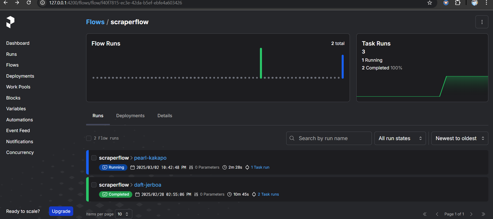

# NUBot: Retrieval-Augmented Generation (RAG) Chatbot

NUBot is an intelligent chatbot designed to assist students and visitors with queries related to Northeastern University, such as courses, faculty, co-op opportunities, and more. It utilizes a Retrieval-Augmented Generation (RAG) approach to provide instant, accurate responses.

## Prerequisites

Before setting up the project, install the necessary dependencies and software.

- Install the Python debugger extension in VS Code:
  - [Python Debugger Extension](https://marketplace.visualstudio.com/items?itemName=ms-python.debugpy)

---

## Features

- Instant responses to academic-related queries.
- Scalable and efficient system for handling high query volumes.
- Continuous updates via cloud deployment.

---

## Setup Steps

### Step 1: Install Ollama Software
1. Download Ollama software.
2. Install the software on your system.

### Step 2: Set Up the Model
1. Open a terminal or command prompt.
2. Run the following command:
   ```sh
   ollama pull mistral
   ```
   This will download the model locally.

### Step 3: Clone the Repository
1. Open a terminal.
2. Clone the Git repository:
   ```sh
   git clone <https://github.com/udishadc/NUBot>
   ```

### Step 4: Install Dependencies
1. Navigate to the cloned repository directory.
2. Run the following command to install all necessary dependencies:
   ```sh
   pip install .
   ```

---

## Running the Backend

### Step 5: Start the Backend Service
1. Open a terminal.
2. Run one of the following commands:
   ```sh
   python -m src.backend.api
   ```
   or
   ```sh
   python3 -m src.backend.api
   ```
   This starts the backend service using Flask.

---

## Running the Frontend

### Step 6: Start the Frontend Service
1. Open another terminal.
2. Run the following command:
   ```sh
   streamlit run src/frontend/app.py
   ```
3. Open a browser and navigate to:
   ```sh
   localhost:8501
   ```
   This will launch the frontend interface.
4. Enter a query and wait for the response.

---

## Running the DAG

### Airflow (Not Recommended)
1. Airflow requires Docker and takes too long to run.
2. To install and run Airflow:
   - Install Docker.
   - Follow Airflow setup steps.
3. Airflow can only run the DAG flow for web scraping but will not create embeddings for the corpus.

### Prefect (Recommended)
Prefect is platform-independent (Windows, macOS, Linux) and lightweight.

### Step 7: Start the Prefect Server
1. Open a terminal.
2. Run the following command:
   ```sh
   prefect server start
   ```
3. Open a browser and navigate to:
   ```sh
   localhost:4200
   ```
   This opens the Prefect UI to monitor the workflows.

### Step 8: Run the Workflow
1. Open another terminal.
2. Execute the flow file:
   ```sh
   python -m src.prefectWorkflows.scraper_flow
   ```
3. This runs the scraping workflow, which can be monitored in Prefect UI.

if run succesfully it will show as below

### Step 9(optional): Automating Workflow Execution
1. Prefect flows run manually by default.
2. After deployment, you can schedule the workflow using Prefect Cloud.

---

## Testing the Flows

### Step 10: Running Test Cases
1. Open a terminal.
2. Run the following command to test the scraper workflow:
   ```sh
   python -m unittest tests.test_scraper_flow
   ```
3. Run the following command to test the preprocessing of data:
   ```sh
   python -m unittest tests.test_preprocess_data
   ```

### Modules Used for Testing
- **unittest**: A built-in Python testing framework used for writing and running test cases.
- **mock**: Part of Python’s `unittest.mock` module, used to simulate dependencies and isolate test cases.
- **MagicMock**: A powerful feature of `mock` that allows the simulation of objects, methods, and their return values during testing.

These tests help ensure the correctness of data preprocessing and workflow execution in the pipeline.

---

## Airflow Setup

### Initial Setup (First-Time or After Changes)

1. Install and open Docker.
2. Run the following command to build the project:
   ```sh
   docker compose build
   ```
3. Initialize Airflow:
   ```sh
   docker compose up airflow-init
   ```
4. Start Airflow:
   ```sh
   docker compose up
   ```
5. Open a browser and navigate to `localhost:8080`.
6. Locate the DAG **"web_scraping"**, run it, and wait until the status shows **Success** (dark green color).

### Stopping Airflow

To stop Airflow, open a new terminal and run:

```sh

docker compose down
```

### Running Airflow from the Second Time Onwards

1. Start in detached mode:

   ```sh
   docker compose up -d
   ```

2. Run:

   ```sh
   docker compose up
   ```

---

## Prefect Workflow Setup

### Installation

To install Prefect with all dependencies, run:

```sh
pip install -U prefect
```

### Running Prefect Server

Start the Prefect UI server on port 4200 by running:

```sh
prefect server start
```

Once started, access the UI at: [http://localhost:4200](http://localhost:4200)

### Running the Workflow

Run the DAG script in `src/prefectWorkflows` using one of the following commands:

```sh
python scraper_flow.py
# OR
python -m src.prefectWorkflows.scraper_flow
```

After execution, refresh the Prefect UI at `http://localhost:4200` to see the running DAG.

### Deploying to Prefect Cloud

To deploy and run workflows anywhere, first log in to Prefect Cloud:

```sh
prefect cloud login
```

Then, register the flows and deploy them accordingly.

---

By following these steps, you can efficiently run, test, and manage your Prefect workflows both locally and in the cloud.

# Logging and Exception Handling in NuBot

## Overview
NuBot utilizes the Python `logging` module for tracking events and debugging information across different services. Additionally, we have implemented custom exception handling to manage errors efficiently and provide meaningful error messages.

## Logging Implementation
We have integrated logging into all major services, ensuring that all critical operations are recorded. The following services include dedicated logging mechanisms:

- **Frontend**
- **Backend**
- **Data Processing**
- **Other Processing Services**

### Log Location
All logs generated by NuBot can be found at:
```
NuBot/logs
```
These logs help in debugging issues, monitoring application performance, and ensuring system reliability.

### Logging Usage
We use the `logging` module to capture important information, including:
- **INFO**: General application flow (e.g., API calls, processing steps)
- **WARNING**: Potential issues that may require attention
- **ERROR**: Errors that prevent certain operations from completing
- **DEBUG**: Detailed information useful for debugging purposes

Each service contains a dedicated logging file where all events are recorded systematically.

---

## Exception Handling
NuBot has a structured exception handling framework to ensure robust error management. Each service includes an exception handling module that captures and processes errors efficiently.

### Custom Exception Handling
We have implemented a `CustomException` class to manage unexpected errors across different components. This ensures that:
- Errors are logged appropriately
- Useful error messages are provided
- The system remains stable and operational

### Example of Exception Logging
If an exception occurs, it is logged along with relevant details:
```python
try:
    # Some code execution
except Exception as e:
    logging.error(f"An error occurred: {str(e)}")
    raise CustomException(e, sys)
```
This structured approach ensures better traceability of issues and easier debugging.

---

## Summary
- **Logging is implemented across all major services (Frontend, Backend, Data Processing, etc.).**
- **Logs can be accessed at `NuBot/logs`.**
- **Custom exception handling ensures robust error management.**
- **All critical events and errors are recorded systematically.**

By leveraging logging and structured exception handling, NuBot maintains stability, traceability, and better error resolution. 🚀

