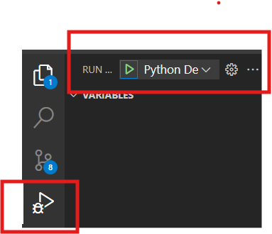

````markdown
# NUBot: Retrieval-Augmented Generation (RAG) Chatbot

NUBot is an intelligent chatbot designed to assist students and visitors with queries related to Northeastern University, such as courses, faculty, co-op opportunities, and more. It utilizes a Retrieval-Augmented Generation (RAG) approach to provide instant, accurate responses.

## Prerequisites

Before setting up the project, install the Python debugger extension in VS Code:

- [Python Debugger Extension](https://marketplace.visualstudio.com/items?itemName=ms-python.debugpy)

## Features

- Instant responses to academic-related queries.
- Scalable and efficient system for handling high query volumes.
- Continuous updates via cloud deployment.

---

## Setup

### Installing Dependencies

1. Add dependencies in the `pyproject.toml` under the `_dependencies_` array.
2. Run the following command to install them:

   ```bash
   pip install .
   ```
````

---

## Backend Setup

To run the backend service, choose one of the following methods:

### Option 1: Using Python Command

1. Go to the root directory of **NUBot**.
2. Run the following command:

   ```bash
   python -m src.backend.api
   ```

### Option 2: For Linux/macOS (Terminal)

1. Open the terminal in the **NUBot** directory.
2. Set the environment variable and start the Flask server:

   ```bash
   export FLASK_APP=src.backend.api
   flask run
   ```

### Option 3: For Windows (Command Prompt)

1. Open the terminal in the **NUBot** directory.
2. Set the environment variable and start the Flask server:

   ```bash
   set FLASK_APP=src.backend.api
   flask run
   ```

### Option 4: Running via VS Code (Run and Debug)

1. Open **Run and Debug** in VS Code.
2. Click on the **Run** button to start the backend.



The backend will now be running at [http://localhost:5000](http://localhost:5000).

---

## Airflow Setup

### Initial Setup (First-Time or After Changes)

1. Install and open Docker.
2. Run the following command to build the project:

   ```bash
   docker compose build
   ```

   This will copy/mount the entire repository to Docker to resolve import errors.

3. Initialize Airflow:

   ```bash
   docker compose up airflow-init
   ```

   The cursor will stop at `airflow-init exited`. Press **Enter** or any key to continue.

4. Start Airflow:

   ```bash
   docker compose up
   ```

   Wait until the **curl** request appears.

5. Open a browser and navigate to `localhost:8080`.
6. Locate the DAG **"web_scraping"**, run it, and wait until the status shows **Success** (dark green color).

   - This DAG scrapes a webpage and stores the data in JSON format.

### Stopping Airflow

To stop Airflow, open a new terminal and run:

```bash
docker compose down
```

### Running Airflow from the Second Time Onwards

1. Start in detached mode:

   ```bash
   docker compose up -d
   ```

2. Run:

   ```bash
   docker compose up
   ```

---

## DVC (Data Version Control) Setup

### Initializing DVC

If DVC is not initialized, run:

```bash
dvc init
```

### Tracking Scraped Data

1. Add tracking to JSON files:

   ```bash
   dvc add scraped_data/
   ```

2. Track changes with Git:

   ```bash
   git add .gitignore scraped_data.dvc
   ```

Once completed, follow the standard Git workflow.

---

## Successful DAG Run Output

On successful execution, the DAG status will appear as follows:


```

```
